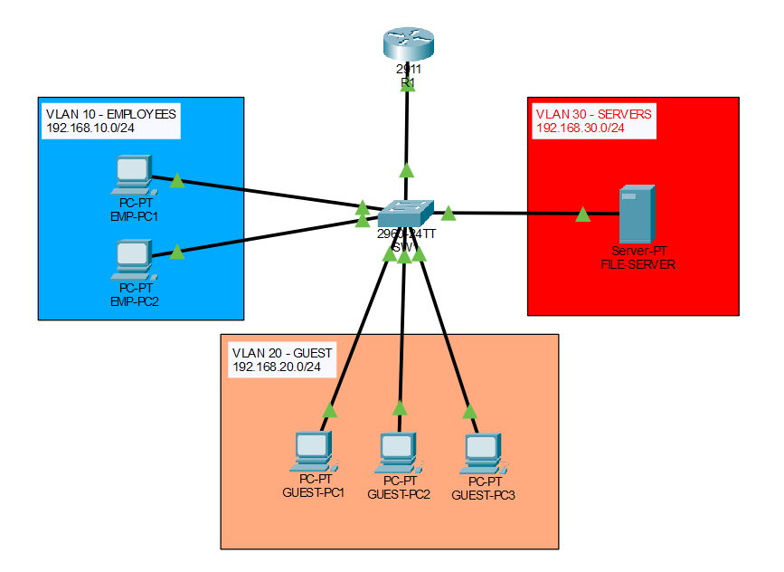

# Network Access Control Lab

## Overview
This project demonstrates network access control using VLAN segmentation, inter-VLAN routing, and access control lists (ACLs) in Cisco Packet Tracer. The lab simulates how enterprise networks restrict guest access to internal server resources while maintaining authorized communication between departments.

## Topology

## Features
- VLAN segmentation for employee, guest, and server networks
- Inter-VLAN routing using Router-on-a-Stick
- ACL-based traffic filtering
- Guest network isolation from internal server resources

## Technologies Used
- Cisco Packet Tracer
- VLANs and Trunking
- Inter-VLAN Routing
- Access Control Lists (ACLs)
- Router-on-a-Stick Configuration
- Cisco IOS CLI

## VLAN Configuration
 ------------------------------------
| VLAN |  Purpose  |      Subnet     |
|------|-----------|-----------------|
|  10  | EMPLOYEES | 192.168.10.0/24 |
|  20  |   GUEST   | 192.168.20.0/24 |
|  30  |  SERVERS  | 192.168.30.0/24 |
 ------------------------------------
## Network Validation
- Verified VLAN segmentation and inter-VLAN connectivity
- Validated ACL enforcement for guest network isolation
- Confirmed authorized employee access to server resources
- Tested end-to-end connectivity across all VLANs

## ACL Verification

## Guest Access Blocked

## Authorized Employee Access

